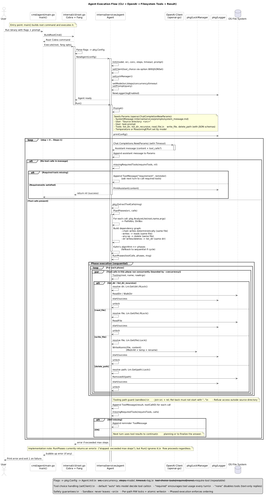

# Workflow Agent

Ever want to run an AI powered agent in a CI/CD ? Now you can! With Agent make security audit tests inside a workflow and make changes, Increase unit tests coverage and apply edits during a pipeline, or make documentation up to date on each action!

---

## See it in action

- Help tour

  

- Project overview (list + read)

  

---

## Quick start

1) Build

```
make build
```

2) Set your OpenAI API key

```
export OPENAI_API_KEY=sk-...
```

3) Try it

```
./bin/agent --help
```

Or run a task:

```
./bin/agent -src . -concurrency 6 -steps 8 -model gpt-4o "Create README.md and list the directory."
```

Run commands (rwx permissions):
- You can ask the agent to run shell commands via the new run_command tool, with per-call permissions.
- Examples the model may choose:
  - { cmd: "make test-one TEST_RUN='^TestWriteReadFile$'", permissions: "rx", timeout: "120s" }
  - { cmd: "go build ./cmd/agent", permissions: "r" }
  - { cmd: "git status", permissions: "r" }
  - { cmd: "git add -A && git commit -m 'wip'", permissions: "rw" }

---

## What it does (in plain English)

- Plans tool calls for your request
- Executes independent steps in parallel, dependent ones in order
- Stays inside the --src directory sandbox
- Uses read/write locks and atomic writes to keep files safe
- Shows concise, styled logs of what happened

---

## CLI flags (what they mean)

- --src: directory sandbox (default .)
- --concurrency: max parallel tool executions per phase (default 4)
- --steps: max assistant planning turns (default 16)
- --model: OpenAI chat model name (default gpt-4o)
- --timeout: per-turn timeout (default 120s)
- --log: pretty logs on/off (default true)
- --tool-choice: tool calling behavior: auto (default) | required | none
- --require-tool: require a specific tool (repeatable)

---

## Flag recipes (combinations that matter)

- Fast local edits with clear logs
  - Why: Everyday tasks where you want quick feedback and safety.
  - Example:
    ```
    ./bin/agent -src . -concurrency 6 -steps 12 -timeout 90s -log true "Write CHANGELOG.md and list the project."
    ```

- Force tool use on every turn
  - Why: Ensure the agent always manipulates the workspace instead of explaining.
  - Example:
    ```
    ./bin/agent -src . --tool-choice required "Create README.md, then read it back."
    ```

- No tools (explain only)
  - Why: Ask for analysis, plans, or walkthroughs without touching files.
  - Example:
    ```
    ./bin/agent -src . --tool-choice none "Explain what this repository does and how to improve docs."
    ```

- Require specific tools
  - Why: Enforce that certain operations occur before finishing.
  - Notes: The agent will keep prompting itself until all required tools are called in a turn.
  - Example:
    ```
    ./bin/agent -src . --tool-choice auto --require-tool write_file --require-tool read_file \
      "Create a CONTRIBUTING.md and show its contents."
    ```

- Concurrency tuning
  - Why: Speed up independent operations, but don’t overdo it for tiny projects.
  - Example:
    ```
    ./bin/agent -src . -concurrency 8 "List the tree and read several files."
    ```

- Short runs for tight feedback loops
  - Why: Keep iteration quick; bail out early.
  - Example:
    ```
    ./bin/agent -src . -steps 4 -timeout 45s "Sketch a plan for refactoring README structure."
    ```

- Quiet mode
  - Why: Reduce terminal noise (logs off) when embedding in scripts.
  - Example:
    ```
    ./bin/agent -src . -log=false "Write a brief SUMMARY.md."
    ```

- Safety-first destructive ops
  - Why: You intend to delete paths; keep scope tight.
  - Example:
    ```
    ./bin/agent -src ./notes "Delete the .cache folder and list the directory."
    ```

Edge cases and interactions
- --tool-choice none + --require-tool: mutually at odds. With tools disabled, required tools cannot be satisfied; use auto or required.
- Multiple --require-tool flags: all must be called within the same turn before the run completes.
- High --concurrency doesn’t bypass dependencies; phases still enforce ordering.
- Short --timeout with long tasks may lead to retries; increase timeout or reduce steps.

---

## Development

See CONTRIBUTING.md for a full developer guide (setup, cross‑platform notes, Makefile usage, and raw Go commands).

## Make helpers

```
make run RUN_ARGS='--help'
make test
make test-one TEST_RUN='^TestWriteReadFile$'
```

---

## Safety guarantees

- Project sandbox: never leaves --src
- Read/Write locks per path
- Atomic writes via temp + rename
- Bounded steps to avoid runaway loops

---

## Troubleshooting

- "command not found: agent" — run `make build` (binary at ./bin/agent)
- "OPENAI_API_KEY not set" — export it in your shell
- Permission errors — ensure you have write access to --src
- No output — add `--log true` (default already true), try a simpler prompt

---

## Under the hood

- Go + OpenAI client
- Cobra + Fang for CLI UX
- Dependency-aware phases for tools
- Tests for list/read/write/delete

---

## One-minute copy/paste

```
make build
export OPENAI_API_KEY=sk-...
./bin/agent --help
./bin/agent -src . -concurrency 6 -steps 8 -model gpt-4o "Create a CONTRIBUTING.md and list the project files."
```

---

## Flow diagram


