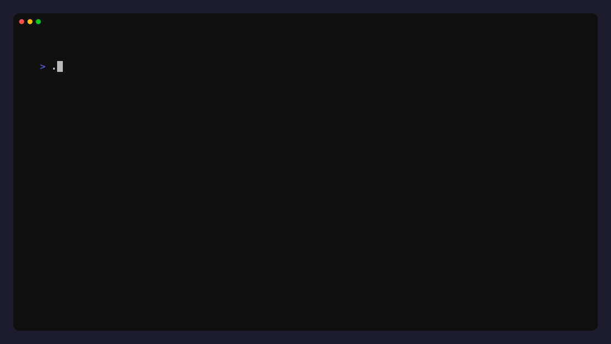

# Agent CLI — your codebase concierge (that doesn’t drink coffee)

Welcome! This tiny command‑line agent helps you make safe, organized changes to a project—like reading files, listing folders, writing new files, or cleaning things up—step by step, with brains and brakes.

It’s designed to be friendly for everyone: you don’t need to be a developer to use it. If you can describe your task in a sentence, the agent will plan it, run carefully‑scoped file tools, and show you what happened.

---

## What this is (and isn’t)
- What it is: a command‑line assistant that plans and performs small, safe file operations inside a single project folder. It’s like a careful handyman for your code or documents.
- What it isn’t: a full remote computer controller. It can’t install software, browse the web, or run arbitrary shell commands. It stays in its lane.

---

## How it works (plain English)
1. You tell the agent what you want (a short sentence). Example: “Create README.md with install/run steps; then show the directory listing.”
2. The agent makes a plan. It figures out which tools to use (like “read file”, “write file”, “list directory”, or “delete path”).
3. It executes tools in sensible phases. Independent tasks run in parallel, but anything that depends on something else will wait its turn.
4. It keeps your files safe:
   - Only works inside the folder you point it at (no wandering into other parts of your computer)
   - Uses read/write locks so tools don’t bump into each other
   - Writes are atomic (temporary file + rename) so you never see half‑written files
5. It shows you what it did, step by step, with clear logs.

That’s it—plan, run, report, stop.

---

## What you can ask it to do
- List folders and files (shallow or deep)
- Read a file’s contents
- Write or update a file
- Delete a file or folder (carefully)

If your request needs those tools, it can probably do it.

---

## Requirements
- A Mac or Linux terminal (Windows works in WSL or any shell that supports Go tools)
- Go (1.21+) installed
- An OpenAI API key (the agent uses GPT to plan steps)

Keep your API key private. You’ll set it as an environment variable.

---

## Quick setup (3 steps)
1) Install dependencies
- Make sure Go is installed: https://go.dev/dl/
- In this folder, run:

```
make build
```

2) Set your OpenAI API key

```
export OPENAI_API_KEY=sk-...   # paste your key here
```

3) Try a dry run

```
./bin/agent --help
```

You’ll see a friendly, styled help page with examples.

---

## Demos

Help


Read (project overview)



---

## Everyday use
- Show help
```
./bin/agent --help
```

- Run a simple task in the current folder
```
./bin/agent -src . -concurrency 6 -steps 16 -model gpt-4o "Create README.md with install/run steps; then show the directory listing."
```

- Safer, faster typed commands with Make (optional)
```
make run RUN_ARGS='-src . --help'
make test
make test-one TEST_RUN="^TestWriteReadFile$"
```

---

## What the flags mean (human terms)
- --src: the folder the agent can see and touch. Defaults to the current folder (.).
- --concurrency: how many independent actions it may run at the same time. Default 4.
- --steps: the maximum number of back‑and‑forth planning turns. Default 16.
- --model: the AI model name (e.g., gpt‑4o). Default gpt‑4o.
- --timeout: a safety timer for each step (e.g., 120s).
- --log: show pretty logs (true/false). Default true.
- --tool-choice: control tool calling behavior: auto (default), required (force tool use every turn), none (disable tools).
- --require-tool: require a specific tool to be called (repeatable). Example: --require-tool write_file

You can combine these however you like.

---

## Safety features that protect your files
- Project sandbox: it stays inside the --src directory you choose
- Read/Write guards: the agent won’t let two tasks fight over the same file
- Atomic writes: content is written to a temp file then swapped in, so you don’t get partial files
- Bounded steps: it stops after the max steps to avoid runaway loops

If anything fails, you’ll get a clear error message.

---

## Troubleshooting
- “command not found: agent” — Build it first: `make build` (binary goes to `./bin/agent`).
- “OPENAI_API_KEY not set” — Set it in your shell: `export OPENAI_API_KEY=sk-...` (use your real key).
- “permission denied” — Make sure you have write access to the folder you pointed at with `--src`.
- No output? Add `--log true` (it’s on by default). Try a simpler prompt to verify.

If you’re stuck, try running the tests to confirm the tools work:
```
make test
```

---

## For the curious (what’s under the hood?)
- Built in Go; uses OpenAI for planning
- Cobra + Fang for a polished, colorful help screen
- Tools implemented as safe, composable operations with dependency‑aware phases
- Tests verify core tools: list, read, write, delete

---

## Responsible use
- The agent can delete files if you ask it to. Double‑check your `--src` path and read the logs.
- Never share your API key. Don’t commit it to version control.

---

## One‑minute quick start (copy/paste)
```
make build
export OPENAI_API_KEY=sk-...
./bin/agent --help
./bin/agent -src . -concurrency 6 -steps 8 -model gpt-4o "Create a CONTRIBUTING.md and list the project files."
```

High‑five. You’re ready to put your codebase concierge to work.

---

## A short story

It was 4:52 PM on a Friday when Lina inherited a repo that looked like a junk drawer. Docs were stale, directories mysterious, and a demo loomed at five. She took a breath and typed:

```
agent -src . -concurrency 6 -steps 8 "List the project, write a fresh README with install/run steps, and show what changed."
```

The agent planned the steps, used only the tools it needed, and worked with surgical care: it mapped the tree, updated files atomically, and reported every move. By 4:58, the build passed, the README read like a tour guide, and the demo slid into place. Lina closed the laptop. The concierge didn’t drink coffee, but it saved hers.
