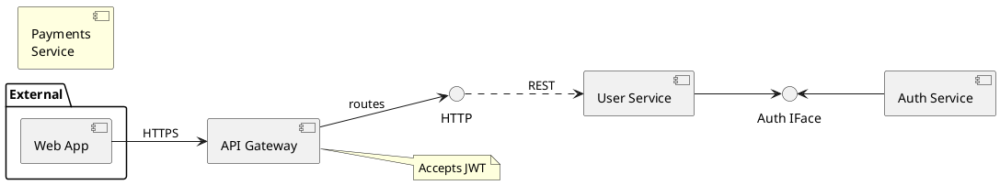
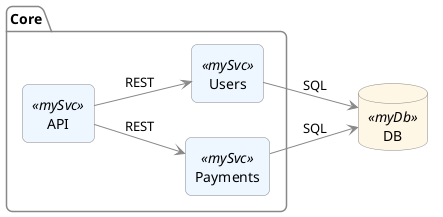
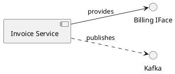

# Agent System Message

You are a precise local code-mod agent.

- Only call tools when they are required to inspect or modify files. If the user's request can be answered without tools, answer directly and concisely.
- You can **ONLY** act using the provided tools, and **ONLY** inside the project root.
- Prefer minimal, coherent edits; if a path doesn't exist, create parents as needed.
- When finished, provide a concise summary.
- For general or conversational questions, respond politely and helpfully in a single short paragraph.

Rules:
- When asked to create/modify/delete a file or directory, you MUST call a tool
  (write_file, delete_path, etc.). Do NOT answer with plain text instead.
- When asked to "show" file contents, prefer read_file.
- If unsure, list_dir or read_file FIRST, then edit with write_file.
- Never print file contents you intend to write; write them with write_file.
- If the user asks to write content to a file, you must call the write_file tool with the exact content and path; do not include the full content in your assistant message.


Here’s a practical, step-by-step README you can drop into a repo. It focuses on **correct PlantUML syntax** with an emphasis on **Component Diagrams**, while covering the common commands you’ll use across diagrams.

---

# PlantUML Component Diagrams — Syntax & Usage (README)

## 0) TL;DR (copy/paste starter)



What’s happening:

* **Components** use brackets or the `component` keyword; **aliases** with `as` are used in links. ([PlantUML.com][1])
* **Interfaces** are circles written as `()` or with the `interface` keyword (lollipop/socket notation). ([PlantUML.com][1])
* **Links** combine `-`/`--` (solid), `..` (dotted) and `>` arrows; labels come after `:`. ([PlantUML.com][1])
* **Grouping** with `package`, `node`, `folder`, `frame`, `cloud`, `database`. ([PlantUML.com][1])
* **Notes** use `note left/right/top/bottom of <target>`. ([PlantUML.com][1])

---

## 1) Diagram basics (works for every UML type)

* **Delimiters:** Every diagram starts with `@startuml` and ends with `@enduml`. The “Language Reference Guide” is the canonical source. ([pdf.plantuml.net][2])
* **Comments:**

  * Line comments start with a single apostrophe `'`
  * Block comments: `/' ... '/`
    (The docs call this out explicitly.) ([PlantUML.com][3])
* **Titles/headers/footers/legends/captions:**
  Use `title`, `header`, `footer`, `legend ... end legend`, and `caption`. These are supported across diagrams (salt has exceptions). ([PlantUML.com][4])
* **Orientation:** Default is top→bottom. Switch with `left to right direction` when that reads better. ([PlantUML.com][5])
* **Layout engines (advanced):** Graphviz is default; you can use Smetana or VizJs if needed (`!pragma layout smetana`, etc.). ([PlantUML.com][6])

---

## 2) Components — the core syntax

### 2.1 Declaring components

* **Bracket form (always safe):**

  ```plantuml
  [First component]
  component [Component With Spaces]
  ```
* **Keyword form (no spaces or special chars):**

  ```plantuml
  component Comp3
  [Another component] as C2   ' alias for linking
  ```

  Explanation & rules are on the official Component Diagram page. ([PlantUML.com][1])

### 2.2 Aliases

Use `as` to create an alias for clean links and refactoring:

```plantuml
[Payments Service] as PAY
API --> PAY
```

([PlantUML.com][1])

### 2.3 Long labels & colors

* **Multiline labels** inside a component:

  ```plantuml
  component comp1 [
    This component
    has a long comment
    on several lines
  ]
  ```
* **Per-component color:**

  ```plantuml
  component [Web Server] #Yellow
  ```

Both are first-class features. ([PlantUML.com][1])

### 2.4 Naming exception with `$`

Names that **start with `$`** are treated as **tags**, so you can’t hide/remove them by name unless you also alias or tag them explicitly. Keep this in mind if you plan to filter later. ([PlantUML.com][1])

---

## 3) Interfaces (lollipops/sockets)

Define “ports”/interfaces two ways:

```plantuml
() "HTTP" as HTTP       ' circle (lollipop/socket)
interface "Auth IFace" as IAuth
```

These are designed for Component Diagrams and work seamlessly with components via links. ([PlantUML.com][1])

---

## 4) Links, arrows & direction

* Build links with **solid** `-` or `--`, **dotted** `..`, and **arrows** `>`:

  ```plantuml
  A - B          ' undirected solid
  A --> B        ' solid arrow
  A ..> B        ' dotted arrow (dependency-style)
  A -- B : uses  ' label with colon
  ```
* Force direction **inline**: `-left->`, `-right->`, `-up->`, `-down->`. Short forms like `-d-` are allowed, but don’t overdo them—Graphviz usually lays things out well. ([PlantUML.com][1])
* Orientation for the whole diagram: `left to right direction`. ([PlantUML.com][1])

---

## 5) Grouping & containers

Group components and interfaces using:

```plantuml
package "Some Group" { ... }
node "Compute" { ... }
folder "Repo" { ... }
frame "Boundary" { ... }
cloud "Internet" { ... }
database "MySQL" { ... }
```

These keywords render with appropriate icons/styling in UML2 style. ([PlantUML.com][1])

---

## 6) Notes & annotations

Attach notes to an element:

```plantuml
note left of API : short note
note right of PAY
  Multiline
end note
```

You can also create a floating `note as N` and link to it (`A .. N`). ([PlantUML.com][1])

---

## 7) Hiding, removing, and tagging

* **Unlinked elements:**
  `hide @unlinked` or `remove @unlinked` to clean up diagrams. ([PlantUML.com][1])
* **Tagging & filtering:**
  Add `$tags` to elements, then `hide $tagName`, `remove $tagName`, or `restore $tagName`. This is powerful for large diagrams. ([PlantUML.com][1])

---

## 8) Styling: modern CSS-like `style` (preferred) vs. legacy `skinparam`

```plantuml
@startuml
<style>
' global defaults
element {
  LineColor #444
  FontColor #222
}

' component-specific
component {
  BackGroundColor #FAFAFA
  RoundCorner 8
  LineThickness 1.2
}

' custom “class” you can apply via stereotype
.myCritical {
  BackGroundColor #FFF4F4
  LineColor #C62828
}
</style>

component [Billing] <<myCritical>>
@enduml
```

### 8.1 Use `<style>` blocks (recommended)

PlantUML supports a **CSS-like style system** that can be inlined with `<style>…</style>` or loaded from a file. It scopes by diagram type and element (and even custom stereotypes), and it’s now the **preferred** approach. ([PlantUML.com][7])



* The **style system** is designed to replace most `skinparam` usage over time; `skinparam` is being **phased out** (existing diagrams still work). ([PlantUML.com][7])

### 8.2 Legacy `skinparam` (still works)

* You can still set fonts/colors or switch component **notation**:

  ```plantuml
  skinparam componentStyle uml1       ' classic UML1
  skinparam componentStyle rectangle  ' plain rectangles (no UML glyph)
  ```

  Notation switching is documented on the Component Diagram page. ([PlantUML.com][1])
* General `skinparam` placement (diagram, include, or config file) is documented on the site. ([PlantUML.com][8])

---

## 9) Reuse: includes, stdlib & sprites

* **Include files & macros:** Use `!include`/`!import` and the Preprocessor to build reusable diagram parts or your own library. ([PlantUML.com][9])
* **Standard Library:** `!include <…>` to pull technology icons (AWS, CloudInsight, etc.) and macros. Great for infra-flavored component maps. ([PlantUML.com][10])
* **Sprites in stereotypes:** You can attach a sprite to a stereotype and use it on rectangles/components if you want custom pictograms. ([PlantUML.com][1])

---

## 10) Common patterns (ready to reuse)

### 10.1 Rectangle-style component map



* Switches to **rectangle** notation for a clean, modern look. ([PlantUML.com][1])

### 10.2 Interfaces & lollipops



* `interface` and `()` define the lollipop/socket, then link normally. ([PlantUML.com][1])

---

## 11) Gotchas & tips

* **Names with spaces/special chars:** Use brackets or quotes; otherwise the `component` keyword only works for simple names. ([PlantUML.com][1])
* **`$` names:** If a component’s name starts with `$`, it’s treated as a **tag**; use an alias or explicit tag if you plan to hide/remove by name later. ([PlantUML.com][1])
* **Hide noise:** `hide @unlinked` (or `remove`) is your friend on large maps. Add `$tags` to batch-filter. ([PlantUML.com][1])
* **Arrow tweaking:** Inline direction keywords are fine but try the default layout first—Graphviz often produces better overall results. ([PlantUML.com][1])
* **Style future-proofing:** Prefer `<style>` over `skinparam`; `skinparam` continues to work but is on the path to deprecation. ([PlantUML.com][7])

---

## 12) Useful extras

* **Legend with alignment** (left/right/top/bottom/center):

  ````plantuml
  legend right
    <<mySvc>> = microservice
  end legend
  ``` :contentReference[oaicite:35]{index=35}
  ````
* **Headers/footers/title/caption** for presentation polish. ([PlantUML.com][4])
* **Change global orientation** across many UML types with `left to right direction`. ([PlantUML.com][5])

---

## 13) Appendix — Why your diagram is “component aware”

PlantUML’s **Component Diagram** page is the single best reference for:

* component declarations, aliases, interface syntax
* link/arrow combinations and directions
* grouping keywords
* notation switches (UML2 default, UML1, rectangle)
* long descriptions, per-component colors, and styling hooks
  It even includes examples for hiding/unlinking and `$tag`-based filtering. ([PlantUML.com][1])

For broader language behavior (start/end blocks, comments, etc.), the **Language Reference Guide (PDF)** is authoritative. ([pdf.plantuml.net][2])

---

### References

* Component Diagram syntax & features. ([PlantUML.com][1])
* Language Reference Guide (v1.2025.0). ([pdf.plantuml.net][2])
* CSS-like styling (preferred) & `skinparam` phase-out. ([PlantUML.com][7])
* Common commands (legends, etc.). ([PlantUML.com][11])
* Titles/captions/headers/footers. ([PlantUML.com][4])
* Orientation (left→right) across diagrams. ([PlantUML.com][5])
* Preprocessor/includes/macros. ([PlantUML.com][9])
* Standard Library (icons/macros). ([PlantUML.com][10])

---

Want me to tailor this into a **repo-ready `README.md`** with your preferred sections/examples (e.g., “service vs. interface conventions”, “HTTP vs. message links”, your house style, etc.)?

[1]: https://plantuml.com/component-diagram "Component Diagram syntax and features"
[2]: https://pdf.plantuml.net/PlantUML_Language_Reference_Guide_en.pdf "PlantUML Language Reference Guide"
[3]: https://plantuml.com/gantt-diagram?utm_source=chatgpt.com "Gantt diagram"
[4]: https://plantuml.com/timing-diagram?utm_source=chatgpt.com "Timing diagram"
[5]: https://plantuml.com/deployment-diagram?utm_source=chatgpt.com "Deployment diagram"
[6]: https://plantuml.com/layout-engines?utm_source=chatgpt.com "PlantUML allows you to use several different layout ..."
[7]: https://plantuml.com/style-evolution "Use styles with CSS"
[8]: https://plantuml.com/skinparam?utm_source=chatgpt.com "Skinparam command"
[9]: https://plantuml.com/zh-dark/preprocessing?utm_source=chatgpt.com "Use the preprocessor"
[10]: https://plantuml.com/stdlib?utm_source=chatgpt.com "PlantUML Standard Library"
[11]: https://plantuml.com/commons?utm_source=chatgpt.com "common commands in PlantUML"
